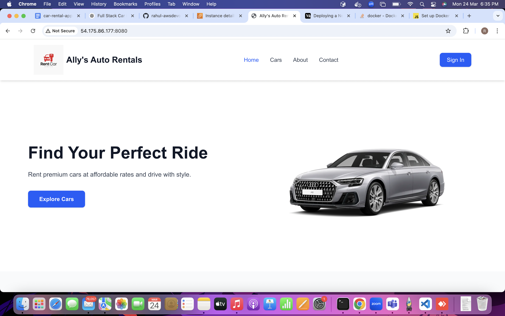
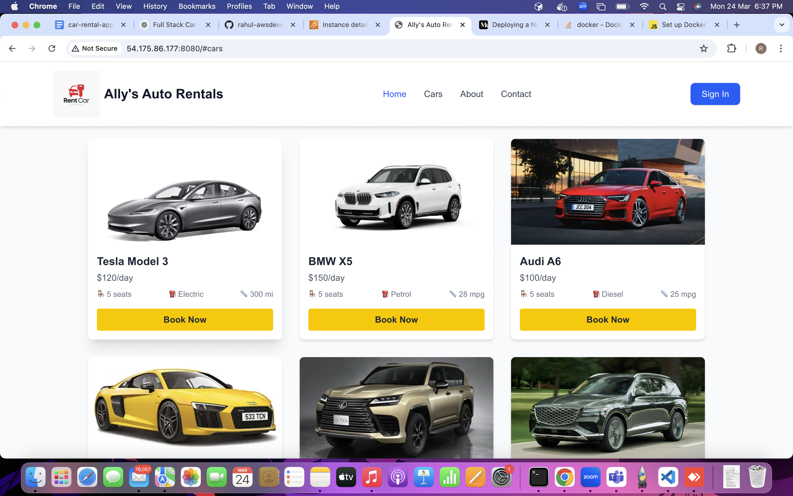
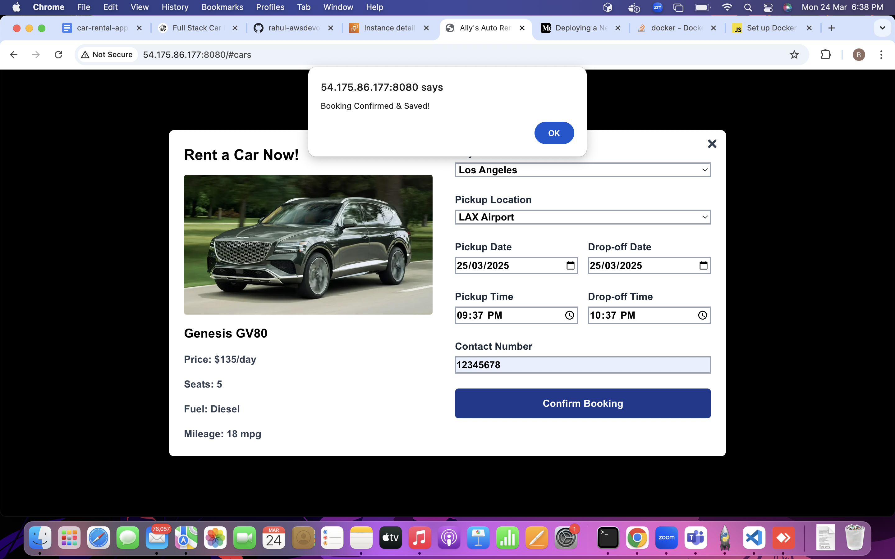
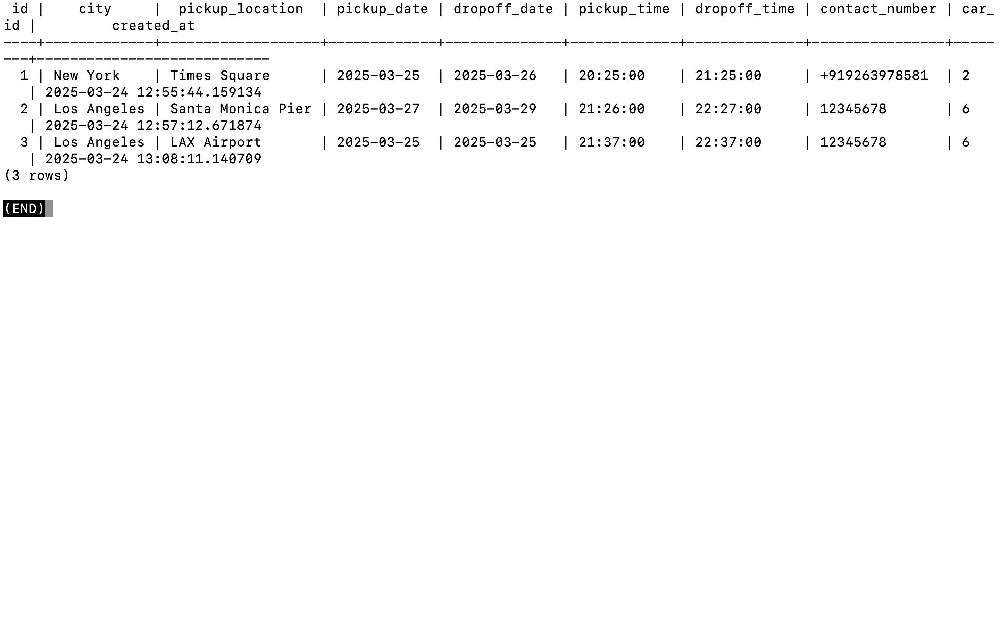

# 🚗 Car Rental App

A modern car rental platform built with **Next.js** (frontend), **Node.js** (backend), **PostgreSQL** (database), and **Nginx reverse proxy** to handle API routing. 

---

## 📸 Screenshots

### 🖥️ Homepage


### 🚘 Car Listing with "Book Now" Modal


### 📝 Booking Confirmation


### 🗄️ Bookings in Database (PostgreSQL)


---

## 🛠️ Tech Stack

- **Frontend**: Next.js + TailwindCSS + DaisyUI
- **Backend**: Node.js + Express
- **Database**: PostgreSQL
- **Reverse Proxy**: NGINX

---

## 🏗️ Architecture Overview

```text
Browser --> NGINX (Reverse Proxy) --> Next.js (Frontend)
                                --> Node.js (Backend API) --> PostgreSQL
